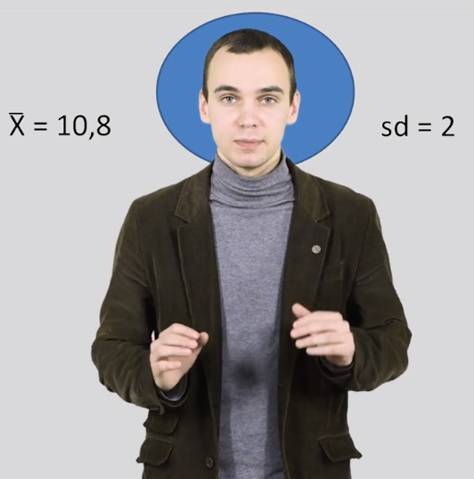

# Основы статистики

все объёмный конспект [лекций ](https://stepik.org/course/76)

Автор лекций: **Anatoliy Karpov** 

Так как рендер ноутбуков от гитхаб грубоват, то читать лекции удобнее от [сюда ](https://nbviewer.jupyter.org/github/KlukvaMors/basic_stat/blob/main/конспект.ipynb?flush_cache=true)

